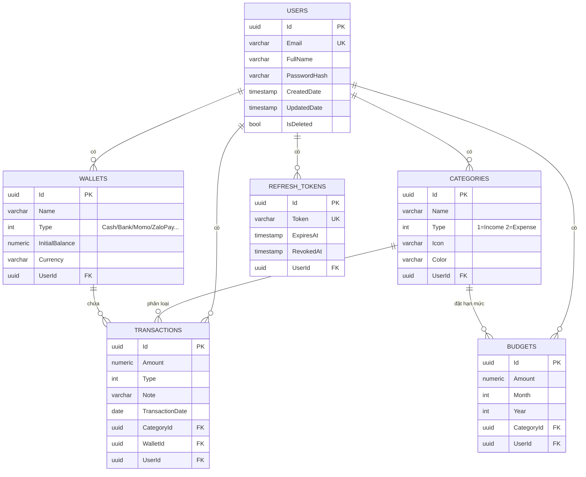

# 💰 Expense Manager — Ứng dụng Quản lý Thu Chi Cá Nhân

Ứng dụng quản lý thu chi cá nhân full-stack theo **Clean Architecture**:

- **Backend**: .NET 8 Web API · EF Core · PostgreSQL · JWT · CQRS (MediatR) · Repository + Unit of Work · FluentValidation · AutoMapper · Swagger
- **Frontend**: Angular 18 · Angular Material · Chart.js · Dark Mode · PWA
- **DevOps**: Docker Compose (PostgreSQL + API + Web) · Unit Test (xUnit)

## ✨ Tính năng

| Nhóm | Tính năng |
|---|---|
| Xác thực | Đăng ký / Đăng nhập, JWT + Refresh Token (rotation) |
| Danh mục | CRUD + tìm kiếm + phân trang, icon & màu sắc tùy chọn |
| Giao dịch | Thu nhập / Chi tiêu, ghi chú, ngày giao dịch, danh mục, ví; lọc đa tiêu chí + phân trang |
| Ví tiền | Nhiều ví: Tiền mặt, Ngân hàng, Momo, ZaloPay, Thẻ tín dụng… với số dư realtime |
| Ngân sách | Hạn mức theo danh mục/tháng, **cảnh báo khi dùng ≥80% và khi vượt 100%** |
| Dashboard | Tổng thu/chi tháng, số dư hiện tại, biểu đồ thu chi 6 tháng, top danh mục chi tiêu |
| Báo cáo | Lọc theo khoảng thời gian, **xuất Excel** (ClosedXML) và **PDF** (QuestPDF) |
| Import | Import sao kê ngân hàng **CSV/Excel**, AI tự phân loại từng giao dịch |
| AI | Phân loại giao dịch tự động (từ khóa tiếng Việt, tùy chọn nâng cấp Claude API), thống kê & nhận xét chi tiêu thông minh |
| UX | Dark Mode, Responsive, **PWA** (cài như app mobile), **Notification nhắc nhập chi tiêu hằng ngày** (20h) |
| Kỹ thuật | Soft Delete, Audit Fields (CreatedDate/UpdatedDate), Global Exception Middleware, Pagination |

## 🚀 Chạy dự án

### Cách 1: Docker Compose (khuyến nghị)

```bash
docker compose up --build
```

| Service | URL |
|---|---|
| Frontend (Angular + nginx) | http://localhost:8080 |
| Backend API | http://localhost:5000 |
| Swagger UI | http://localhost:5000/swagger |
| PostgreSQL | localhost:5432 (postgres/postgres) |

Mở http://localhost:8080 → Đăng ký tài khoản → hệ thống tự tạo sẵn danh mục mặc định + ví Tiền mặt.

### Cách 2: Chạy local (dev)

**Yêu cầu**: .NET 8 SDK, Node.js 20+, PostgreSQL 16 (hoặc `docker compose up postgres`)

```bash
# 1. Database
docker compose up -d postgres

# 2. Backend (http://localhost:5000)
cd backend
dotnet run --project src/ExpenseManager.API --urls http://localhost:5000

# 3. Frontend (http://localhost:4200 — proxy /api → localhost:5000)
cd frontend
npm install
npm start
```

### Unit Tests

```bash
cd backend
dotnet test
```

### Bật AI phân loại bằng Claude API (tùy chọn)

Mặc định AI phân loại dùng bộ luật từ khóa tiếng Việt (offline, miễn phí). Để dùng Claude API,
đặt biến môi trường cho service `api` trong `docker-compose.yml` (hoặc `appsettings.json`):

```yaml
Anthropic__ApiKey: "sk-ant-..."
```

> **Lưu ý migration**: Để đơn giản khi demo, API gọi `EnsureCreated()` lúc khởi động để tạo schema.
> Cho production, hãy chuyển sang EF Migrations:
> ```bash
> cd backend
> dotnet ef migrations add Initial --project src/ExpenseManager.Infrastructure --startup-project src/ExpenseManager.API
> ```
> và thay `EnsureCreated()` bằng `Migrate()` trong `Program.cs`.

## 🗄️ Database Schema

Tất cả các bảng đều có **Audit Fields** (`CreatedDate`, `UpdatedDate`) và **Soft Delete** (`IsDeleted` + global query filter).

| Bảng | Cột chính |
|---|---|
| **Users** | Id (PK, uuid), Email (unique), FullName, PasswordHash (BCrypt) |
| **Categories** | Id, Name, Type (1=Income, 2=Expense), Icon, Color, UserId (FK) |
| **Wallets** | Id, Name, Type (Cash/Bank/Momo/ZaloPay/CreditCard/Other), InitialBalance, Currency, UserId (FK) |
| **Transactions** | Id, Amount (numeric 18,2), Type, Note, TransactionDate (date), CategoryId (FK), WalletId (FK), UserId (FK) |
| **Budgets** | Id, Amount, Month, Year, CategoryId (FK), UserId (FK) — unique theo (User, Category, Month, Year) |
| **RefreshTokens** | Id, Token (unique), ExpiresAt, RevokedAt, UserId (FK) |

## 📊 ERD



## 🏗️ Cấu trúc Clean Architecture

```
backend/
├── ExpenseManager.sln
├── Dockerfile
├── src/
│   ├── ExpenseManager.Domain/            # Lớp trong cùng — không phụ thuộc gì
│   │   ├── Common/BaseEntity.cs          # Id, CreatedDate, UpdatedDate, IsDeleted
│   │   ├── Entities/                     # User, Category, Transaction, Wallet, Budget, RefreshToken
│   │   └── Enums/                        # TransactionType, WalletType
│   ├── ExpenseManager.Application/       # Business logic — CQRS với MediatR
│   │   ├── Common/
│   │   │   ├── Behaviors/                # ValidationBehavior (FluentValidation pipeline)
│   │   │   ├── Exceptions/               # NotFound, Conflict, Unauthorized...
│   │   │   ├── Interfaces/               # IRepository, IUnitOfWork, IJwtTokenService...
│   │   │   ├── Mappings/                 # AutoMapper profile
│   │   │   └── Models/                   # DTOs, PagedResult
│   │   └── Features/                     # Auth, Categories, Transactions, Wallets,
│   │                                     # Budgets, Dashboard, Reports, Import, Ai
│   ├── ExpenseManager.Infrastructure/    # EF Core, services bên ngoài
│   │   ├── Persistence/                  # AppDbContext (soft delete + audit), Repository, UnitOfWork
│   │   └── Services/                     # JWT, BCrypt, Excel, PDF, AI classifier, CSV/Excel parser
│   └── ExpenseManager.API/               # Presentation
│       ├── Controllers/                  # Auth, Categories, Transactions, Wallets,
│       │                                 # Budgets, Dashboard, Reports, Import, Ai
│       ├── Middleware/                   # GlobalExceptionMiddleware
│       └── Program.cs                    # DI, JWT, Swagger, CORS
└── tests/
    └── ExpenseManager.UnitTests/         # xUnit + Moq + FluentAssertions + EF InMemory

frontend/
├── Dockerfile, nginx.conf, angular.json, ngsw-config.json (PWA)
└── src/app/
    ├── core/                             # models, auth service/guard/interceptor,
    │                                     # API services, theme (dark mode), reminder (notification)
    ├── shared/                           # confirm dialog
    └── features/                         # auth, layout, dashboard, transactions,
                                          # categories, wallets, budgets, reports, import
```

## 📡 API chính

| Method | Endpoint | Mô tả |
|---|---|---|
| POST | `/api/auth/register` · `/login` · `/refresh` | Xác thực |
| GET/POST/PUT/DELETE | `/api/categories` | Danh mục (search + phân trang) |
| GET/POST/PUT/DELETE | `/api/transactions` | Giao dịch (lọc theo ngày/loại/danh mục/ví) |
| GET/POST/PUT/DELETE | `/api/wallets` | Ví tiền (kèm số dư hiện tại) |
| GET/POST/PUT/DELETE | `/api/budgets` · GET `/api/budgets/alerts` | Ngân sách + cảnh báo |
| GET | `/api/dashboard?month&year` | Số liệu tổng quan + biểu đồ |
| GET | `/api/reports?fromDate&toDate` · `/export/excel` · `/export/pdf` | Báo cáo |
| POST | `/api/import/bank-statement` | Import sao kê CSV/Excel (multipart) |
| POST | `/api/ai/classify` · GET `/api/ai/insights` | AI phân loại & thống kê |

File sao kê mẫu: [`docs/sample-bank-statement.csv`](docs/sample-bank-statement.csv)
